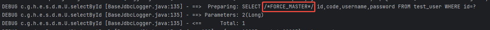

Spring Boot是Spring框架的一个扩展，旨在简化Spring应用的初始搭建和开发过程。它提供了大量的自动配置和可插拔的组件，使得开发人员能够快速构建基于Java的应用程序。

通过将Hint集成到Spring Boot应用中，可以快速地在原有的代码中实现Hint语法功能。这种集成方式利用了Spring Boot的自动配置和依赖注入特性，使得代码的编写和维护更加简单。

## 背景
现在MYSQL数据库架构采用一主多从；

主库（Master）：唯一接受写请求的节点，通过二进制日志（binlog）记录变更，承担数据一致性的核心职责。

从库（Slave）：实时异步复制主库的binlog，通过relay log重放实现数据同步，支持水平扩展读能力。

**优势**：读扩展性、高可用基石、数据安全、负载隔离

**典型问题**：主从延迟难题、主库单点瓶颈、数据一致性保障

保障主数据库安全，采用了读写隔离，但这样可能就会遇到主从延迟难题。下面介绍我们遇到的问题及解决方案。

### 问题：
我们数据库是腾讯云的MYSQL，并开始了数据库代理功能（[数据库代理功能：自动读写分离功能、自适应负载均衡功能、事务拆分功能等](https://cloud.tencent.com/document/product/236/103847)）。但是存在一个问题：新增数据或者修改数据后，因为我们读写分离的，读是链接从库，写是主库，短时间内再去查询偶尔出现数据延迟问题。

### 解决方案：
+ 代码连接多个数据源：当需要方案主库时候切换到主库数据源。
+ 数据库采用代理方式，使用hint语法指定SQL强制路由到主库。

## 组件实现内容：
使用 Hint 语法可以强制 SQL 请求在指定的实例上执行，Hint 的路由优先级最高，例如，Hint 不受一致性、事务的约束，使用前请合理评估业务场景是否需要。

[云数据库 MySQL Hint 语法使用_腾讯云](https://cloud.tencent.com/document/product/236/82243)

## 组件设计
源码地址github（[https://github.com/wangzhiqiangzzz/mybatis-hint-spring-boot](https://github.com/wangzhiqiangzzz/mybatis-hint-spring-boot)）

## 核心代码解析
### Hint上下文（HintContext）:
上下文主要管理Hint 语句、及SQL添加Hint标志等。

```java
public class HintContext {

    private static final ThreadLocal<String> hint = ThreadLocal.withInitial(() -> null);

    public static void markHint(String s) {
        hint.set(s);
    }

    public static boolean isHint() {
        return StringUtils.isNotBlank(hint.get());
    }

    public static String getHint() {
        return hint.get();
    }

    public static void clear() {
        hint.remove();
    }

}
```

### 拦截器
作为MyBatis的灵魂组件，拦截器的核心价值在于实现SQL执行全流程的精细化控制，覆盖参数处理、SQL改写、结果集加工等场景。其底层通过动态代理拦截四大核心接口：

+ Executor：控制SQL执行逻辑（增删改查）
+ StatementHandler：介入SQL预编译与参数绑定
+ ParameterHandler：实现参数二次处理
+ ResultSetHandler：定制化结果集映射。

主要运用了Executor拦截器，对查询SQL进行拦截，当Hint上下文存在时候，对SQL进行修改，下面代码是今天SQL修改核心代码。

```java
     private void changeSQL(BoundSql boundSql, String hint) {
                String originalSql = boundSql.getSql();
                String newSql = originalSql.replaceFirst("(?i)SELECT\\s+", "SELECT "+ hint +" ");
                // 使用MetaObject对象将新的SQL语句设置到BoundSql对象中
                MetaObject metaObject = SystemMetaObject.forObject(boundSql);
                metaObject.setValue("sql", newSql);
        }
```

## 快速开始
源代码（[https://github.com/wangzhiqiangzzz/mybatis-hint-spring-boot/tree/master/mybatis-hint-examples](https://github.com/wangzhiqiangzzz/mybatis-hint-spring-boot/tree/master/mybatis-hint-examples)）

### 添加maven
```xml
<dependency>
  <groupId>com.github.hint</groupId>
  <artifactId>mybatis-hint-spring-boot-starter</artifactId>
</dependency>
```

### 添加配置
```yaml
hint:
  enable: true
```

### 代码demo
hint上下文设置hint语句（`HintContext.markHint(MysqlEnum.TO_MASTER.getHint()); `）

备注：`TO_MASTER("/*FORCE_MASTER*/", "强制走主库")`

接下来执行SQL，User pojo = this.getById(id);

```java

//采用MysqlEnum的hint语句
public UserInfoVO getInfoById(Long id) {

        // 强制路由到主库查询
        HintContext.markHint(MysqlEnum.TO_MASTER.getHint());
        // 执行数据库查询
        User pojo = this.getById(id);
        if (pojo == null) {
            return null;
        }
        UserInfoVO userInfoVO = new UserInfoVO();
        userInfoVO.setCode(pojo.getCode());
        userInfoVO.setName(pojo.getUsername());
        return userInfoVO;
    }

//自定义的hint语句
public UserInfoVO getInfoById(Long id) {

        // 强制路由到指定的实例
        HintContext.markHint("/* to server test_ro_1 */");
        // 执行数据库查询
        User pojo = this.getById(id);
        if (pojo == null) {
            return null;
        }
        UserInfoVO userInfoVO = new UserInfoVO();
        userInfoVO.setCode(pojo.getCode());
        userInfoVO.setName(pojo.getUsername());
        return userInfoVO;
    }
```

执行结果：`SELECT /*FORCE_MASTER*/ id,code,username,password FROM test_user WHERE id=?`

## 其它
关注公众号【 java程序猿技术】


